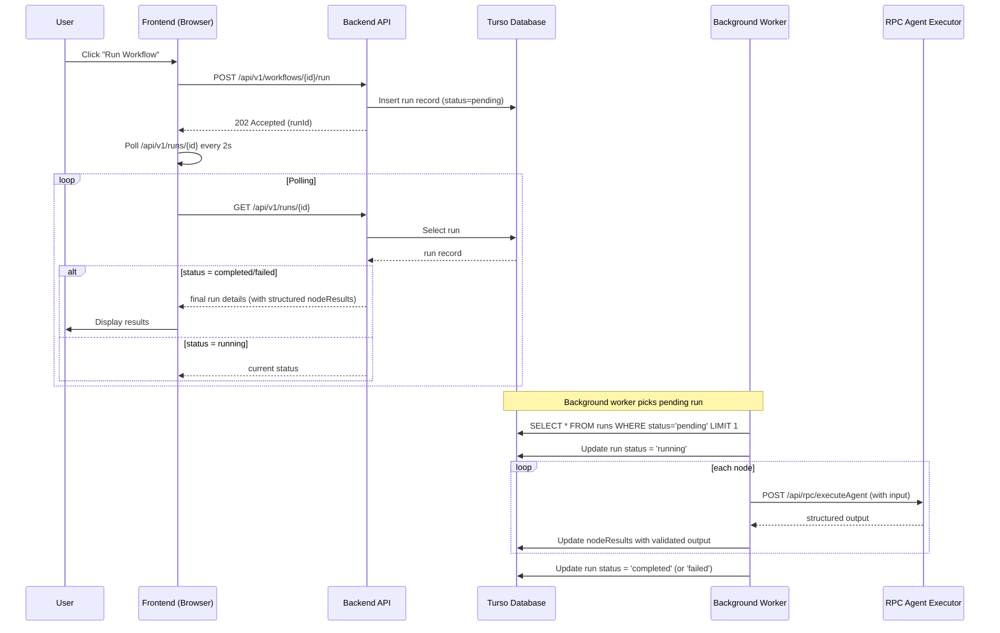
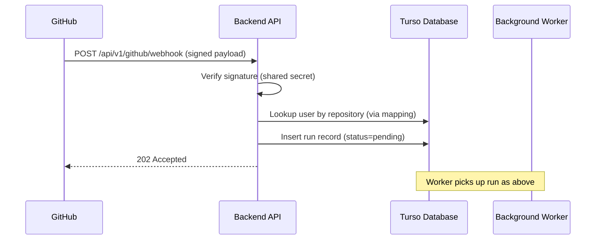
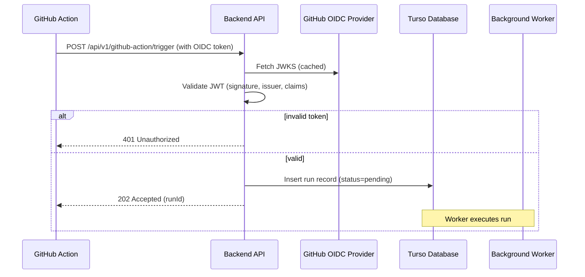
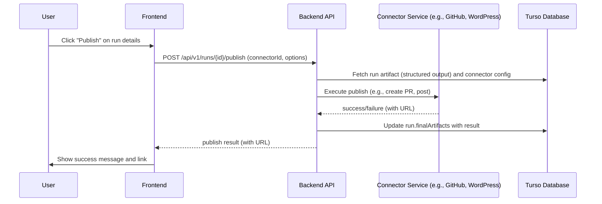
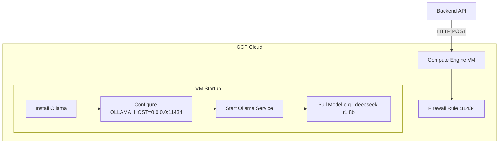

# Technical Design & API Specifications

| Field | Value |
|-------|-------|
| Project | AI Content Agent Dashboard |
| Document | Technical Design & API Specifications |
| Version | 1.7 |
| Date | 2026-03-14 |
| Author | [System Architect] |
| Status | Final – Approved by Development Team |

---

## 1. Overview

This document provides the detailed technical design for the AI Content Agent Dashboard, incorporating feedback from the development team review. It includes:

- **API design** using `next-rest-framework` for type-safe, self-documenting endpoints.
- **Database schema** defined using Drizzle ORM (TypeScript) for Turso (SQLite), extended to store structured skill outputs. Field names are inferred from property names (no need to pass them explicitly).
- **Frontend structure** using Next.js App Router with **kebab-case** naming convention for all files. UI components are built with **shadcn/ui** and **Lucide React** icons.
- **Sequence diagrams** (Mermaid) for critical flows.
- **LLM adapter interface** and circuit breaker implementation.
- **Ollama hosting options** on free cloud tiers.
- **Environment variables** and configuration.
- **Error handling, validation, and logging** best practices.

All designs are aligned with the approved SRS, Architecture, and UX specifications.

---

## 2. API Design with next-rest-framework

### 2.1 Principles

We will use **[next-rest-framework](https://github.com/blomqma/next-rest-framework)** to build our API. This library provides:

- **Type‑safe** request/response handling with Zod schemas.
- **Auto‑generated OpenAPI specification** (`openapi.json`) and documentation (ReDoc/SwaggerUI).
- Support for both **App Router** and **Pages Router** (we use App Router).
- **RPC‑style endpoints** that can also be used as server actions.
- **Middleware support** for authentication and validation.
- **Form data handling** via `zod-form-data`.

The OpenAPI spec will be generated automatically from our route definitions and kept in sync with the code. The `next-rest-framework validate` command will be part of CI to ensure the spec is up‑to‑date.

### 2.2 Endpoint Overview

| Endpoint | Method | Description | Authentication |
|----------|--------|-------------|----------------|
| `/api/v1/auth/[...nextauth]` | Various | NextAuth.js GitHub OAuth | Public |
| `/api/v1/workflows` | GET | List all workflows for user | Session |
| `/api/v1/workflows` | POST | Create a new workflow | Session |
| `/api/v1/workflows/{id}` | GET | Get workflow details | Session |
| `/api/v1/workflows/{id}` | PUT | Update workflow (creates new version) | Session |
| `/api/v1/workflows/{id}` | DELETE | Delete workflow | Session |
| `/api/v1/workflows/{id}/versions` | GET | List versions of a workflow | Session |
| `/api/v1/workflows/{id}/run` | POST | Start a workflow run | Session |
| `/api/v1/runs` | GET | List runs (with filters) | Session |
| `/api/v1/runs/{id}` | GET | Get run details | Session |
| `/api/v1/agents` | GET | List available AI agents | Session |
| `/api/v1/connectors` | GET | List user’s configured connectors | Session |
| `/api/v1/connectors` | POST | Add a new connector | Session |
| `/api/v1/connectors/{id}` | PUT | Update connector | Session |
| `/api/v1/connectors/{id}` | DELETE | Remove connector | Session |
| `/api/v1/connectors/{id}/test` | POST | Test connector configuration | Session |
| `/api/v1/github/webhook` | POST | Receive GitHub webhook events | GitHub secret |
| `/api/v1/github-action/trigger` | POST | Triggered by GitHub Action (OIDC) | OIDC token |

### 2.3 Example Route Implementation (App Router)

Below is a sample implementation of the workflows endpoints using `next-rest-framework`.

```typescript
// app/api/v1/workflows/route.ts
import { route, routeOperation, TypedNextResponse } from 'next-rest-framework';
import { z } from 'zod';
import { getServerSession } from 'next-auth';
import { authOptions } from '@/lib/auth';
import { db } from '@/db';
import { workflows, workflowVersions } from '@/db/schema';
import { eq } from 'drizzle-orm';

const workflowSchema = z.object({
  id: z.string(),
  name: z.string(),
  currentVersionId: z.string().optional(),
  createdAt: z.date(),
  updatedAt: z.date(),
});

const workflowInputSchema = z.object({
  name: z.string().min(1).max(100),
  description: z.string().optional(),
  definition: z.object({}).passthrough(), // flexible JSON
});

export const { GET, POST } = route({
  // GET /api/v1/workflows - list workflows
  getWorkflows: routeOperation({
    method: 'GET',
    openApiOperation: {
      summary: 'List workflows',
      tags: ['workflows'],
    },
  })
    .outputs([
      {
        status: 200,
        contentType: 'application/json',
        body: z.array(workflowSchema),
      },
    ])
    .handler(async () => {
      const session = await getServerSession(authOptions);
      if (!session?.user) {
        return TypedNextResponse.json({ error: 'Unauthorized' }, { status: 401 });
      }

      const userWorkflows = await db
        .select()
        .from(workflows)
        .where(eq(workflows.userId, session.user.id));

      return TypedNextResponse.json(userWorkflows, { status: 200 });
    }),

  // POST /api/v1/workflows - create new workflow
  createWorkflow: routeOperation({
    method: 'POST',
    openApiOperation: {
      summary: 'Create workflow',
      tags: ['workflows'],
    },
  })
    .input({
      contentType: 'application/json',
      body: workflowInputSchema,
    })
    .outputs([
      {
        status: 201,
        contentType: 'application/json',
        body: workflowSchema,
      },
      {
        status: 400,
        contentType: 'application/json',
        body: z.object({ error: z.string() }),
      },
    ])
    .handler(async (req) => {
      const session = await getServerSession(authOptions);
      if (!session?.user) {
        return TypedNextResponse.json({ error: 'Unauthorized' }, { status: 401 });
      }

      const { name, definition } = await req.json();

      // Insert workflow
      const [workflow] = await db
        .insert(workflows)
        .values({
          id: crypto.randomUUID(),
          userId: session.user.id,
          name,
          createdAt: new Date(),
          updatedAt: new Date(),
        })
        .returning();

      // Create initial version
      await db.insert(workflowVersions).values({
        id: crypto.randomUUID(),
        workflowId: workflow.id,
        version: 1,
        definition,
        changelog: 'Initial version',
        createdAt: new Date(),
      });

      return TypedNextResponse.json(workflow, { status: 201 });
    }),
});
```

### 2.4 RPC for Agent Execution

We will use RPC endpoints for executing individual agents (skills). This allows us to reuse the same logic as server actions for internal calls during workflow runs.

```typescript
// app/agents/actions.ts
'use server';

import { rpcOperation } from 'next-rest-framework';
import { z } from 'zod';
import { getAgent } from '@/agents/registry';
import { createLLMCircuitBreaker } from '@/services/circuit-breaker';

export const executeAgent = rpcOperation()
  .input({
    contentType: 'application/json',
    body: z.object({
      agentType: z.string(),
      codeContext: z.string(),
      prompt: z.string().optional(),
    }),
  })
  .outputs([
    {
      status: 200,
      contentType: 'application/json',
      body: z.object({
        output: z.any(), // Will be validated against agent's schema in handler
      }),
    },
    {
      status: 500,
      contentType: 'application/json',
      body: z.object({ error: z.string() }),
    },
  ])
  .handler(async ({ agentType, codeContext, prompt }) => {
    const agent = getAgent(agentType);
    if (!agent) {
      return { error: `Agent ${agentType} not found` };
    }

    try {
      // Use circuit breaker around LLM call
      const breaker = createLLMCircuitBreaker(agent.llmAdapter);
      const result = await breaker.fire({ codeContext, prompt, agentType });
      
      // Validate output against agent's output schema
      const validated = agent.outputSchema.parse(JSON.parse(result));
      return { output: validated };
    } catch (err: any) {
      console.error(`Agent execution failed: ${err.message}`);
      return { error: err.message };
    }
  });
```

The RPC route mounts these operations:

```typescript
// app/api/rpc/[operationId]/route.ts
import { rpcRoute } from 'next-rest-framework';
import { executeAgent } from '@/app/agents/actions';

export const { POST } = rpcRoute({
  executeAgent,
});

export type RpcClient = typeof POST.client;
```

### 2.5 OpenAPI Generation & CI

We will add the following scripts to `package.json`:

```json
{
  "scripts": {
    "generate:openapi": "NODE_OPTIONS='--import=tsx' next-rest-framework generate",
    "validate:openapi": "NODE_OPTIONS='--import=tsx' next-rest-framework validate"
  }
}
```

The OpenAPI spec will be generated at `/public/openapi.json` and accessible via `/api/v1/docs` (using the docs endpoint). CI will run `validate:openapi` to ensure the spec is up‑to‑date.

---

## 3. Database Schema (Drizzle ORM)

The database is **Turso** (SQLite). Below are the Drizzle table definitions in TypeScript, updated to store structured skill outputs. Note that we use the shorthand syntax where field names are inferred from the property names (no need to pass the field name string explicitly).

### 3.1 Schema Definition

```typescript
// db/schema.ts
import { sqliteTable, text, integer } from 'drizzle-orm/sqlite-core';
import { relations } from 'drizzle-orm';

export const users = sqliteTable('users', {
  id: text().primaryKey(),
  githubId: integer().unique().notNull(),
  email: text().notNull(),
  name: text(),
  avatarUrl: text(),
  plan: text({ enum: ['free', 'pro'] }).default('free').notNull(),
  usageMonth: integer().default(0).notNull(),
  sandboxUsed: integer().default(0).notNull(),
  createdAt: integer({ mode: 'timestamp' }).notNull(),
  updatedAt: integer({ mode: 'timestamp' }).notNull(),
});

export const workflows = sqliteTable('workflows', {
  id: text().primaryKey(),
  userId: text()
    .notNull()
    .references(() => users.id, { onDelete: 'cascade' }),
  name: text().notNull(),
  currentVersionId: text(), // references workflow_versions.id
  createdAt: integer({ mode: 'timestamp' }).notNull(),
  updatedAt: integer({ mode: 'timestamp' }).notNull(),
});

export const workflowVersions = sqliteTable('workflow_versions', {
  id: text().primaryKey(),
  workflowId: text()
    .notNull()
    .references(() => workflows.id, { onDelete: 'cascade' }),
  version: integer().notNull(),
  definition: text({ mode: 'json' }).notNull(), // JSON string
  changelog: text(),
  createdAt: integer({ mode: 'timestamp' }).notNull(),
});

export const runs = sqliteTable('runs', {
  id: text().primaryKey(),
  workflowId: text()
    .notNull()
    .references(() => workflows.id, { onDelete: 'cascade' }),
  status: text({
    enum: ['pending', 'running', 'completed', 'failed'],
  }).notNull(),
  startedAt: integer({ mode: 'timestamp' }).notNull(),
  completedAt: integer({ mode: 'timestamp' }),
  nodeResults: text({ mode: 'json' }).notNull(), // Stores structured outputs per node
  finalArtifacts: text({ mode: 'json' }), // JSON of published results
  sandbox: integer({ mode: 'boolean' }).default(false).notNull(),
});

export const connectors = sqliteTable('connectors', {
  id: text().primaryKey(),
  userId: text()
    .notNull()
    .references(() => users.id, { onDelete: 'cascade' }),
  type: text({ enum: ['github-pr', 'wordpress'] }).notNull(),
  config: text({ mode: 'json' }).notNull(), // encrypted JSON
  createdAt: integer({ mode: 'timestamp' }).notNull(),
  updatedAt: integer({ mode: 'timestamp' }).notNull(),
});

// Relations (optional, for query building)
export const usersRelations = relations(users, ({ many }) => ({
  workflows: many(workflows),
  connectors: many(connectors),
}));

export const workflowsRelations = relations(workflows, ({ one, many }) => ({
  user: one(users, { fields: [workflows.userId], references: [users.id] }),
  versions: many(workflowVersions),
  runs: many(runs),
  currentVersion: one(workflowVersions, {
    fields: [workflows.currentVersionId],
    references: [workflowVersions.id],
  }),
}));

export const workflowVersionsRelations = relations(workflowVersions, ({ one }) => ({
  workflow: one(workflows, {
    fields: [workflowVersions.workflowId],
    references: [workflows.id],
  }),
}));

export const runsRelations = relations(runs, ({ one }) => ({
  workflow: one(workflows, {
    fields: [runs.workflowId],
    references: [workflows.id],
  }),
}));

export const connectorsRelations = relations(connectors, ({ one }) => ({
  user: one(users, { fields: [connectors.userId], references: [users.id] }),
}));
```

**Structured Output Storage:**  
The `nodeResults` column stores a JSON object mapping node IDs to their outputs, which are validated against the agent's Zod schema at runtime. Example:

```json
{
  "node1": {
    "status": "completed",
    "output": {
      "summary": "This feature improves dashboard load time by 40%.",
      "citations": ["Gartner 2024", "Internal benchmarks"]
    },
    "error": null
  },
  "node2": {
    "status": "pending"
  }
}
```

The Zod schemas for each agent are defined in the agent registry and used both for execution validation and for type‑safe access when displaying results.

### 3.2 Migrations

Migrations will be generated using Drizzle Kit. Example command:

```bash
drizzle-kit generate:sqlite --schema db/schema.ts --out migrations
```

Migrations will be applied at deployment time (e.g., as part of CI/CD). We will use a migration script that runs before the app starts.

---

## 4. Frontend Structure (Next.js App Router)

The frontend is built with Next.js App Router, providing a modern React architecture with server and client components. The structure follows the UX mockups and includes pages for dashboard, workflows, runs, agents, connectors, and settings. **All frontend files use kebab-case naming convention**, including components, pages, and utilities.

We use **shadcn/ui** for component primitives, which provides accessible, unstyled components that we can theme with Tailwind CSS. **Lucide React** is used for all icons, ensuring a consistent and modern look.

### 4.1 Page Routes

```
app/
├── (auth)/
│   ├── login/
│   │   └── page.tsx               # Login page (redirects to GitHub OAuth)
│   └── callback/
│       └── route.ts                # OAuth callback handler (via NextAuth)
├── (dashboard)/
│   ├── layout.tsx                  # Dashboard layout with sidebar
│   ├── page.tsx                    # Dashboard home (recent runs, quick actions)
│   ├── workflows/
│   │   ├── page.tsx                 # Workflows list
│   │   ├── [id]/
│   │   │   ├── page.tsx             # Workflow editor
│   │   │   └── versions/
│   │   │       └── page.tsx         # Version history
│   │   └── new/
│   │       └── page.tsx             # Create new workflow (wizard)
│   ├── runs/
│   │   ├── page.tsx                 # Runs list
│   │   └── [id]/
│   │       └── page.tsx             # Run details
│   ├── agents/
│   │   ├── page.tsx                 # Agents library
│   │   └── [agent]/
│   │       └── page.tsx             # Agent details (schema, examples)
│   ├── connectors/
│   │   ├── page.tsx                 # Connectors list
│   │   └── new/
│   │       └── page.tsx             # Add connector wizard
│   └── settings/
│       ├── page.tsx                 # Profile, API keys, billing
│       └── github/
│           └── page.tsx             # GitHub integration settings
├── api/
│   └── v1/
│       └── ...                      # API routes (as defined in section 2)
└── layout.tsx                       # Root layout
```

### 4.2 Component Structure (kebab-case)

```
components/
├── ui/
│   ├── button.tsx            # shadcn/ui button
│   ├── card.tsx              # shadcn/ui card
│   ├── input.tsx             # shadcn/ui input
│   ├── select.tsx            # shadcn/ui select
│   ├── dialog.tsx            # shadcn/ui dialog (modal)
│   ├── toast.tsx             # shadcn/ui toast
│   └── ...
├── dashboard/
│   ├── sidebar.tsx
│   ├── header.tsx
│   ├── recent-runs.tsx
│   └── quick-actions.tsx
├── workflows/
│   ├── workflow-canvas.tsx          # Node-based editor (React Flow)
│   ├── node-palette.tsx
│   ├── node-config.tsx
│   └── version-history.tsx
├── runs/
│   ├── run-status-badge.tsx
│   ├── node-results.tsx
│   └── publish-buttons.tsx
├── agents/
│   ├── agent-card.tsx
│   └── agent-detail.tsx
├── connectors/
│   ├── connector-card.tsx
│   └── connector-form.tsx
└── settings/
    ├── profile-form.tsx
    ├── api-keys.tsx
    └── billing.tsx
```

All UI components from shadcn/ui are customized to match our brand colors and typography. Lucide React icons are imported as needed, e.g.:

```tsx
import { Play, Save, Trash2 } from 'lucide-react';
```

### 4.3 State Management & Data Fetching

- **Server Components:** Used for static or authenticated data fetching (e.g., workflows list, runs list). Data is fetched directly from the database using server actions or API routes.
- **Client Components:** Used for interactive parts (workflow editor, forms). Data is fetched via SWR or React Query for real‑time updates and caching.
- **Server Actions:** Used for mutations (create workflow, run workflow, publish). These call the corresponding RPC operations or API routes directly.

### 4.4 Real‑time Updates

For run progress, we use polling (as designed) or optionally Server‑Sent Events. The frontend polls `/api/v1/runs/{id}` every 2 seconds and updates the UI.

### 4.5 Styling

We use Tailwind CSS with a custom design system matching the UX spec. shadcn/ui provides a set of pre‑built components that we can style with our `tailwind.config.js` theme. Lucide icons are sized and colored via Tailwind classes.

---

## 5. Sequence Diagrams

The following diagrams illustrate key flows using Mermaid syntax.

### 5.1 Manual Workflow Execution



### 5.2 GitHub Webhook Triggered Workflow



### 5.3 GitHub Action OIDC Trigger



### 5.4 Publishing Flow



---

## 6. Agent Registry & Structured Outputs

### 6.1 Agent Registry

Each agent (skill) is defined with:

- `name`: unique identifier
- `description`: human‑readable
- `inputSchema`: Zod schema for expected input (from previous node or constants)
- `outputSchema`: Zod schema for the generated content
- `llmAdapter`: LLM adapter instance (could be shared)
- `execute`: function that takes input and returns output matching the schema

```typescript
// agents/registry.ts
import { z } from 'zod';
import { OllamaAdapter } from '@/services/llm/ollama';
import { LLMAdapter } from '@/services/llm/adapter';

export interface Agent {
  name: string;
  description: string;
  inputSchema: z.ZodObject<any>;
  outputSchema: z.ZodObject<any>;
  llmAdapter: LLMAdapter;
  execute: (input: any, context: { codeContext: string }) => Promise<any>;
}

const ollama = new OllamaAdapter(process.env.OLLAMA_BASE_URL!);

const researchWriter: Agent = {
  name: 'research-writer',
  description: 'Researches topics and adds citations',
  inputSchema: z.object({
    topic: z.string(),
  }),
  outputSchema: z.object({
    summary: z.string(),
    citations: z.array(z.string()),
  }),
  llmAdapter: ollama,
  execute: async (input, { codeContext }) => {
    const prompt = `Research the topic "${input.topic}" using this code context:\n${codeContext}\nProvide a JSON response with fields: summary (string), citations (array of strings).`;
    const result = await ollama.generateContent({
      codeContext,
      prompt,
      agentType: 'research-writer',
    });
    // Parse and validate
    const parsed = JSON.parse(result);
    return researchWriter.outputSchema.parse(parsed);
  },
};

export const agents: Record<string, Agent> = {
  'research-writer': researchWriter,
  // ... other agents
};

export function getAgent(name: string): Agent | undefined {
  return agents[name];
}
```

### 6.2 Workflow Execution with Structured Outputs

During a workflow run, the background worker:

1. Retrieves the workflow definition (from `workflow_versions`).
2. For each node, resolves input from previous node outputs (or constants).
3. Calls the agent's `execute` method with the input and code context.
4. Validates the returned output against the agent's `outputSchema`.
5. Stores the validated output in `nodeResults` (as JSON).

If validation fails, the node is marked as `failed` and the run stops.

---

## 7. Ollama Hosting on Free Cloud Tiers

For the MVP, we need to host an Ollama instance that our backend can call for LLM inference. Below are viable options for free or low-cost hosting.

### 7.1 Google Cloud Platform (GCP) Free Tier with Terraform

**Overview:** GCP offers a generous free tier with $300 credits for new users, which is sufficient to run a small VM for several months. Using Terraform, we can provision a Compute Engine VM with Ollama pre-installed.

**Estimated Costs:**
- New GCP accounts receive **$300 in free credits**.
- An `e2-standard-2` VM (2 vCPU, 8GB RAM) costs approximately $0.067/hour (~$48/month). With free credits, this covers ~6 months of runtime.

**Architecture:**


**Terraform Configuration (main.tf):**
```hcl
provider "google" {
  credentials = file("credentials.json")
  project     = var.project_id
  region      = var.region
  zone        = var.zone
}

resource "google_compute_instance" "ollama_vm" {
  name         = "ollama-instance"
  machine_type = "e2-standard-2"  # 2 vCPU, 8GB RAM - adjust based on model requirements
  zone         = var.zone

  boot_disk {
    initialize_params {
      image = "ubuntu-os-cloud/ubuntu-2204-lts"
      size  = 50  # GB - enough for OS + models
    }
  }

  network_interface {
    network = "default"
    access_config {}  # Ephemeral public IP
  }

  metadata_startup_script = file("startup.sh")
  tags = ["ollama-server"]
}

resource "google_compute_firewall" "allow_ollama" {
  name    = "allow-ollama"
  network = "default"

  allow {
    protocol = "tcp"
    ports    = ["11434"]
  }

  source_ranges = ["0.0.0.0/0"]  # ⚠️ Restrict in production!
  target_tags   = ["ollama-server"]
}
```

**Startup Script (startup.sh):**
```bash
#!/bin/bash
apt update && apt install -y curl

# Install Ollama
curl -fsSL https://ollama.com/install.sh | sh

# Configure Ollama to listen on all interfaces
mkdir -p /etc/systemd/system/ollama.service.d
echo -e "[Service]\nEnvironment=\"OLLAMA_HOST=0.0.0.0:11434\"" > /etc/systemd/system/ollama.service.d/override.conf

# Start Ollama
systemctl daemon-reload
systemctl enable ollama
systemctl start ollama

# Wait for service to start
sleep 10

# Pull a lightweight model (adjust based on needs)
ollama pull deepseek-r1:8b  # ~4.7GB - runs on 8GB RAM
```

**Security Warning:** The firewall rule above allows traffic from any IP. For production, restrict `source_ranges` to your backend's IP range or use a VPC with private networking.

### 7.2 Alternative: Google Colab (Free GPU)

**Overview:** Google Colab provides free access to Tesla T4 GPUs, which can run Ollama for development/testing. This is suitable for prototyping but not for production due to session timeouts.

**Implementation:**
```python
# In Google Colab notebook
!curl -fsSL https://ollama.com/install.sh | sh
!ollama serve &
!ollama pull deepseek-r1:1b  # Small model for Colab
```

**Limitations:**
- Sessions expire after ~12 hours
- Requires tunneling (Pinggy) for external access
- Not suitable for production workloads

### 7.3 Alternative: Railway.app (Paid but Simple)

Railway offers a one‑click deploy for Ollama with OpenWebUI. The free tier has limited resources (insufficient for models), but Pro plans start at ~$20/month with 24GB RAM.

### 7.4 Recommendation for MVP

**Use GCP with Terraform** as it provides:
- Predictable infrastructure-as-code
- $300 free credits
- Full control over VM size and model selection
- Ability to scale vertically as needed

**Model Selection:** For 8GB RAM VMs, use quantized models like:
- `deepseek-r1:8b` (~4.7GB)
- `llama3.2:3b` (~2.0GB)
- `gemma2:9b` (~5.5GB) with swap

**Connection:** The backend will use the VM's public IP (from Terraform outputs) as `OLLAMA_BASE_URL`.

---

## 8. LLM Adapter & Circuit Breaker

### 8.1 Adapter Interface

```typescript
// services/llm/adapter.ts
export interface LLMAdapter {
  generateContent(params: {
    codeContext: string;       // concatenated code/files
    prompt?: string;            // user instructions
    agentType: string;          // e.g., 'copywriting'
  }): Promise<string>;          // Returns JSON string matching the agent's outputSchema
}

// Example implementation for Ollama
export class OllamaAdapter implements LLMAdapter {
  constructor(private baseUrl: string) {}
  
  async generateContent(params): Promise<string> {
    const response = await fetch(`${this.baseUrl}/api/generate`, {
      method: 'POST',
      body: JSON.stringify({
        model: this.selectModel(params.agentType),
        prompt: this.buildPrompt(params),
        stream: false,
        format: 'json', // Request JSON output
        options: {
          temperature: 0.7,
          num_predict: 2000,
        }
      }),
    });
    if (!response.ok) {
      throw new Error(`Ollama API error: ${response.statusText}`);
    }
    const data = await response.json();
    return data.response;
  }

  private selectModel(agentType: string): string {
    const modelMap: Record<string, string> = {
      'research-writer': 'deepseek-r1:8b',
      'copywriting': 'llama3.2:3b',
      'seo-audit': 'gemma2:9b',
      'humanizer': 'llama3.2:1b',
    };
    return modelMap[agentType] || process.env.OLLAMA_DEFAULT_MODEL || 'deepseek-r1:8b';
  }

  private buildPrompt(params): string {
    return `You are a ${params.agentType} agent. Return valid JSON that matches the expected output schema.
Code context:
${params.codeContext}
User instructions: ${params.prompt || 'None'}`;
  }
}
```

### 8.2 Circuit Breaker

We'll use the `opossum` library to wrap LLM calls.

```typescript
// services/circuit-breaker.ts
import CircuitBreaker from 'opossum';
import { LLMAdapter } from './llm/adapter';

const breakerOptions = {
  timeout: parseInt(process.env.CIRCUIT_BREAKER_TIMEOUT || '30000'), // ms
  errorThresholdPercentage: parseInt(process.env.CIRCUIT_BREAKER_THRESHOLD || '50'),
  resetTimeout: parseInt(process.env.CIRCUIT_BREAKER_RESET || '30000'), // ms
  rollingCountTimeout: 60000, // 1 minute
  rollingCountBuckets: 10,
};

export function createLLMCircuitBreaker(adapter: LLMAdapter) {
  return new CircuitBreaker(adapter.generateContent.bind(adapter), breakerOptions);
}
```

Usage in agent execution:

```typescript
const breaker = createLLMCircuitBreaker(agent.llmAdapter);
try {
  const result = await breaker.fire(params);
  // Parse and validate...
} catch (err) {
  if (err.name === 'CircuitBreakerError') {
    throw new Error('LLM service temporarily unavailable. Please try again later.');
  }
  throw err;
}
```

---

## 9. Environment Variables

The following environment variables must be set in production (and development where applicable).

| Variable | Description | Example |
|----------|-------------|---------|
| `DATABASE_URL` | Turso database connection string | `libsql://my-db.turso.io?authToken=...` |
| `GITHUB_CLIENT_ID` | GitHub OAuth client ID | `Iv1.1234567890abcdef` |
| `GITHUB_CLIENT_SECRET` | GitHub OAuth client secret | `abcdef1234567890` |
| `NEXTAUTH_SECRET` | NextAuth.js encryption secret | `a-strong-secret-at-least-32-chars` |
| `NEXTAUTH_URL` | Base URL of the app (for NextAuth) | `https://app.example.com` |
| `GITHUB_WEBHOOK_SECRET` | Secret for verifying GitHub webhooks | `random-webhook-secret` |
| `OLLAMA_BASE_URL` | Base URL for Ollama instance | `http://35.123.45.67:11434` |
| `OLLAMA_DEFAULT_MODEL` | Default model to use | `deepseek-r1:8b` |
| `CIRCUIT_BREAKER_TIMEOUT` | LLM call timeout (ms) | `30000` |
| `CIRCUIT_BREAKER_THRESHOLD` | Error % to open circuit | `50` |
| `CIRCUIT_BREAKER_RESET` | Time before retry (ms) | `30000` |
| `ENCRYPTION_KEY` | Key for encrypting connector secrets (AES‑256) | 32‑byte base64 |

**Important:** The `ENCRYPTION_KEY` must be kept secret and rotated appropriately. All connector configs are encrypted before storage.

---

## 10. Implementation Notes

### 10.1 Complete Next.js Project Structure (kebab-case)

```
.
├── app/
│   ├── (auth)/
│   │   ├── login/
│   │   │   └── page.tsx
│   │   └── callback/
│   │       └── route.ts
│   ├── (dashboard)/
│   │   ├── layout.tsx
│   │   ├── page.tsx
│   │   ├── workflows/
│   │   │   ├── page.tsx
│   │   │   ├── [id]/
│   │   │   │   ├── page.tsx
│   │   │   │   └── versions/
│   │   │   │       └── page.tsx
│   │   │   └── new/
│   │   │       └── page.tsx
│   │   ├── runs/
│   │   │   ├── page.tsx
│   │   │   └── [id]/
│   │   │       └── page.tsx
│   │   ├── agents/
│   │   │   ├── page.tsx
│   │   │   └── [agent]/
│   │   │       └── page.tsx
│   │   ├── connectors/
│   │   │   ├── page.tsx
│   │   │   └── new/
│   │   │       └── page.tsx
│   │   └── settings/
│   │       ├── page.tsx
│   │       └── github/
│   │           └── page.tsx
│   ├── api/
│   │   └── v1/
│   │       ├── auth/
│   │       │   └── [...nextauth]/
│   │       │       └── route.ts
│   │       ├── workflows/
│   │       │   ├── route.ts
│   │       │   ├── [id]/
│   │       │   │   ├── route.ts
│   │       │   │   └── versions/
│   │       │   │       └── route.ts
│   │       │   └── [id]/run/
│   │       │       └── route.ts
│   │       ├── runs/
│   │       │   ├── route.ts
│   │       │   └── [id]/
│   │       │       └── route.ts
│   │       ├── agents/
│   │       │   └── route.ts
│   │       ├── connectors/
│   │       │   ├── route.ts
│   │       │   ├── [id]/
│   │       │   │   ├── route.ts
│   │       │   │   └── test/
│   │       │   │       └── route.ts
│   │       ├── github/
│   │       │   └── webhook/
│   │       │       └── route.ts
│   │       └── github-action/
│   │           └── trigger/
│   │               └── route.ts
│   └── layout.tsx
├── components/
│   ├── ui/
│   │   ├── button.tsx
│   │   ├── card.tsx
│   │   ├── input.tsx
│   │   ├── select.tsx
│   │   ├── dialog.tsx
│   │   └── toast.tsx
│   ├── dashboard/
│   │   ├── sidebar.tsx
│   │   ├── header.tsx
│   │   ├── recent-runs.tsx
│   │   └── quick-actions.tsx
│   ├── workflows/
│   │   ├── workflow-canvas.tsx
│   │   ├── node-palette.tsx
│   │   ├── node-config.tsx
│   │   └── version-history.tsx
│   ├── runs/
│   │   ├── run-status-badge.tsx
│   │   ├── node-results.tsx
│   │   └── publish-buttons.tsx
│   ├── agents/
│   │   ├── agent-card.tsx
│   │   └── agent-detail.tsx
│   ├── connectors/
│   │   ├── connector-card.tsx
│   │   └── connector-form.tsx
│   └── settings/
│       ├── profile-form.tsx
│       ├── api-keys.tsx
│       └── billing.tsx
├── lib/
│   ├── auth.ts
│   ├── github.ts
│   └── encryption.ts
├── db/
│   ├── schema.ts
│   ├── client.ts
│   └── migrations/
├── agents/
│   ├── registry.ts
│   └── actions.ts
├── services/
│   ├── llm/
│   │   ├── adapter.ts
│   │   └── ollama.ts
│   └── circuit-breaker.ts
├── workers/
│   └── workflow-runner.ts
├── styles/
│   └── globals.css
├── public/
│   └── (static assets)
├── .env.local
├── next.config.js
├── tailwind.config.js
├── package.json
└── tsconfig.json
```

### 10.2 Background Worker

We'll use a Vercel cron job (or a separate Node.js service) that runs every minute to process pending runs. The worker:

- Queries `runs` with status `pending`.
- For each, updates status to `running`.
- Executes nodes sequentially, calling the RPC endpoint for each agent.
- Updates `nodeResults` with structured outputs.
- Updates final status.

For large repos, we may need to stream code from GitHub; we'll implement a `GitHubCodeFetcher` that paginates and filters files (only non‑markdown, code files). The code is fetched on demand and passed to the agent.

### 10.3 OIDC Token Validation

We'll implement a middleware in `github-action/trigger.ts` that:

1. Extracts the Bearer token from `Authorization` header.
2. Fetches GitHub's JWKS from `https://token.actions.githubusercontent.com/.well-known/jwks` (cached).
3. Validates the JWT signature and claims:
   - `iss` must be `https://token.actions.githubusercontent.com`
   - `aud` must be our API URL (e.g., `https://app.example.com/api/v1/github-action/trigger`)
   - `repository` claim must match the repository name in the request body.
4. If valid, proceeds; otherwise returns 401.

We'll use `jsonwebtoken` and `jwks-rsa` libraries.

---

## 11. Security Considerations

- **Encryption at rest:** All connector secrets are encrypted using AES‑256‑GCM. The `ENCRYPTION_KEY` is stored in environment variables (never in code).
- **TLS:** All traffic uses TLS 1.2+ (enforced by Vercel).
- **Authentication:** Session cookies are HTTP‑only and secure; OIDC tokens are short‑lived.
- **Input validation:** All API inputs are validated using Zod schemas derived from the database models or agent definitions.
- **Rate limiting:** Applied per user using Upstash Redis or database counters.
- **Ollama firewall:** Restrict access to the Ollama VM to only the backend's IP range (e.g., Vercel's IPs). Use GCP firewall rules to limit `source_ranges`.
- **Error logging:** Sanitize logs to avoid exposing secrets or user code.

---

## 12. Next Steps

1. **Review** this document with the development team (completed).
2. **Set up** GCP account and obtain free credits.
3. **Deploy** Ollama VM using Terraform with the provided configuration.
4. **Set up** Turso database and obtain `DATABASE_URL`.
5. **Initialize** Next.js project with Drizzle, Turso driver, and `next-rest-framework`.
6. **Implement** authentication (NextAuth.js GitHub provider).
7. **Develop** agent registry with structured output schemas.
8. **Implement** core workflow engine and background worker.
9. **Add** LLM adapter with circuit breaker pointing to Ollama VM.
10. **Implement** GitHub webhook and OIDC endpoints.
11. **Write** integration tests for critical flows.
12. **Deploy** to Vercel staging environment.
